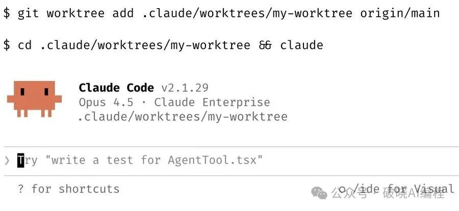
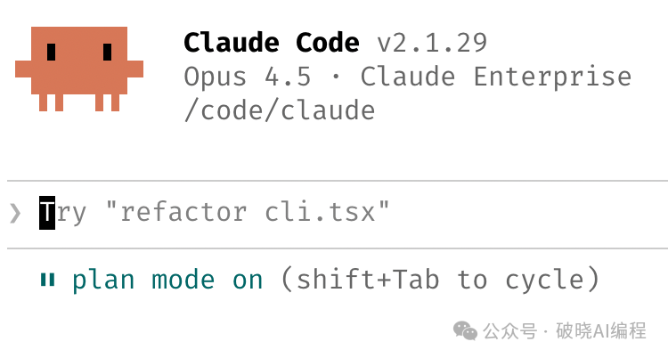
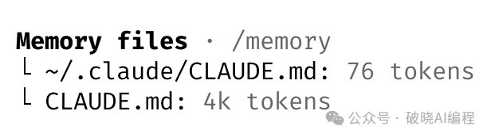
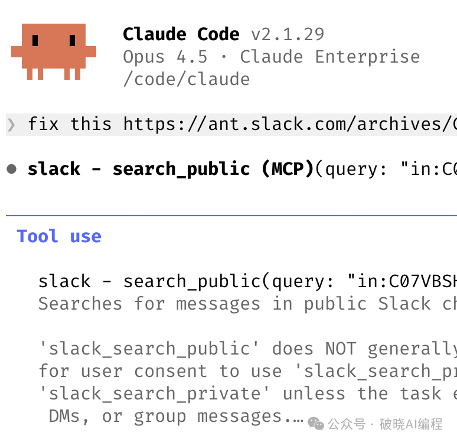
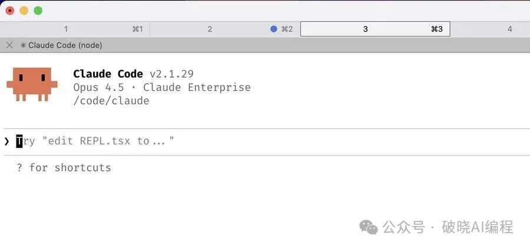
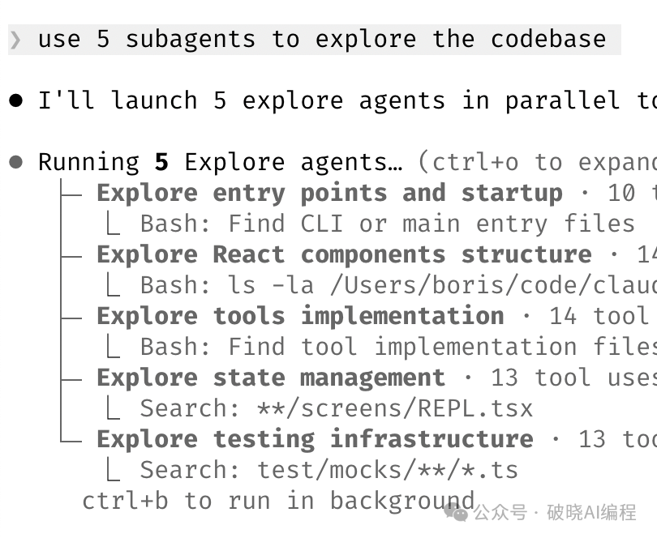

# 10个技巧，通关Claude Code

> 作者：破晓AI编程
> 来源：[微信公众号原文](https://mp.weixin.qq.com/s?__biz=Mzk4ODM4MjYyMw==&mid=2247483941&idx=1&sn=0fe1eacf3715edbb952f007a2f625667&scene=21)

Boris，Claude Code的作者，在Twitter上发布的一篇帖子火了。

他分享了他们团队私藏的10条 AI编程技巧。

看完直呼好家伙，破晓之前用的可真糙。

每一位习惯于用AI编程的开发者，都值得好好看看这10个tips。

看不懂也没关系，一边用一边学习。

话不多说，一起来看看这10条小技巧吧。

## 1. 并行开发，效率加倍

同时启动 3-5 个 git worktree（工作树），每个工作树并行运行各自的 claude 会话。

这是提升效率最有效的方法，也是团队给出的最佳建议。

我个人使用多个 git checkout，但 Claude Code 团队的大多数成员更喜欢工作树--这也是 @amorriscode 在 Claude Desktop 应用程序中内置对工作树原生支持的原因！

有些人还会给工作树命名，并设置 shell 别名（例如 za、zb、zc），以便只需按一次键即可在不同工作树之间切换。另一些人则拥有一个专门的"分析"工作树，该工作树仅用于读取日志和运行 BigQuery。

## 2. 任何时候，计划先行

在开始做一个复杂任务前，先打开plan mode（计划模式）。

集中全部精力把计划写细致，这样claude就可以一次性写好代码。

有些同事会先起一个claude编写计划，然后再起另一个claude作为工程师来审查该计划。

有些同事则习惯于，一旦出现问题，他们就会切换回计划模式并重新制定计划。

不要一味推进。在测试验证环节也需要让claude进入计划模式，而不仅仅是构建阶段。

## 3. 日积月累，沉淀claude.md

好好用好你的CLAUDE.md 。

每次纠正claude的错误后，最后都要加上一句："更新你的CLAUDE.md这样你就不会再犯同样的错误了。"claude非常擅长为自己编写规则。

随着时间的推移，毫不留情地修改你的CLAUDE.md 。不断迭代，直到claude的错误率显著下降。

告诉claude，要为每个任务/项目维护一个笔记目录，并在每次提交PR后更新。然后，将该目录添加到CLAUDE.md。这样claude就能随时使用这些笔记了。

## 4. 将重复工作创建成skills

如果你一天要做某件事不止一次，那就把它变成一个skill或指令。并在所有项目中不断的使用。

一些来自团队内部的tips：

- 创建一个 /techdebt 斜杠命令，并在每次会话结束时运行它，以查找并删除重复代码。
- 设置一个斜杠命令，将 Slack、Google Drive、Asana 和 GitHub 上 7 天的数据压缩同步到claude的context中。
- 构建分析工程师风格的agent，这些agents能够编写数据库策略模型、审查代码并测试开发环境中的变更。

> 了解更多：https://code.claude.com/docs/en/skills

## 5. 让claude自己修复bugs

启用 Slack MCP，然后将 Slack 上讨论bug的内容粘贴到 Claude 中，只需说"修复"即可。无需任何上下文切换。

或者，直接说"去修复失败的持续集成测试"。不要事无巨细地指导具体操作。

让 Claude 查看 docker 日志来排查分布式系统故障--它在这方面表现出乎意料地强大。

一句话，不要多说什么，直接让claude 修！

## 6. 让你的提示词更上一层楼

a. 向 claude 发起挑战。告诉他："好好审查这些改动，在我通过你的测试之前别提交 PR。"让 claude 做你的代码审查员。

或者，告诉他："证明给我看，这行得通。"然后让 Claude 对比主分支和你的特性分支之间的差异。

b. 在采取了不尽如人意的补救措施后，说："鉴于你现在所掌握的所有信息，放弃这个方案，实施更优雅的解决方案。"

c. 在交接工作之前，编写详细的规范并减少歧义。越具体，输出结果就越好。

## 7. 终端和环境配置

团队成员非常喜欢 Ghostty！很多人都喜欢它的同步渲染、24 位色彩和完善的 Unicode 支持。

"为了更轻松地切换 Claude，可以使用 `/statusline` 自定义状态栏，使其始终显示context用量和当前所在的 Git 分支。"

我们很多人还会对终端标签页进行颜色编码和命名，有时还会使用 tmux——每个任务/工作树对应一个标签页。

使用语音输入。你的语速是打字速度的三倍，因此由语音生成的提示词会更加详细。

## 8. 善用subagents

在任何需要 Claude 投入更多计算资源来解决问题的请求中，添加"使用subagents"参数。

将单个任务分给subagents，以保持主agent的上下文窗口简洁且专注于特定任务。

通过钩子将权限请求路由到 Opus 4.5 — 让它扫描攻击并自动批准安全的请求。

> 更多请查看：https://code.claude.com/docs/en/hooks

## 9. 将claude用于数据分析

请让 Claude Code 使用"bq"命令行工具来实时提取和分析指标。我们的代码库中已经集成了 BigQuery skill，团队中的每个人都直接在 Claude Code 中使用它进行分析查询。就我个人而言，我已经超过 6 个月没写过一行 SQL 代码了。

所有具有 CLI、MCP 或 API 的数据库都可以这么用。

## 10. 和claude一起学习

以下是团队提供的使用 Claude Code 进行学习的一些技巧：

a. 在 /config 中启用"解释性"或"学习性"输出样式，以便 claude 解释更改背后的"原因"

b. 让claude制作一个可视化的 HTML 演示文稿来解释不熟悉的代码。它能做出非常棒的ppt！

c. 请claude绘制新协议和代码库的ASCII图，以帮助你理解它们。

d. 培养填空式的学习技巧：你解释你的理解，claude提出后续问题以填补知识空白，并记录学习结果。

---

既然你看到这里了，如果觉得不错，请帮我一键三连，转发给你的朋友，这对我很重要。

谢谢你看我的文章，祝你万事顺遂，我们下期见。
