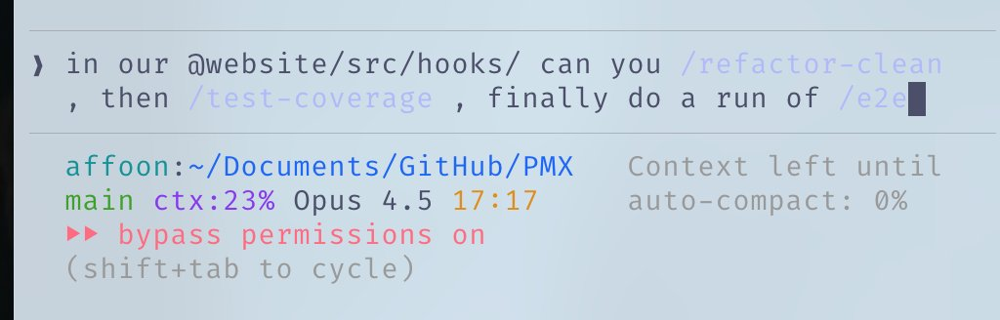
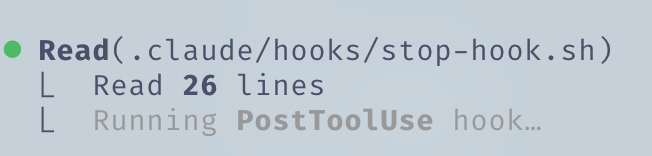
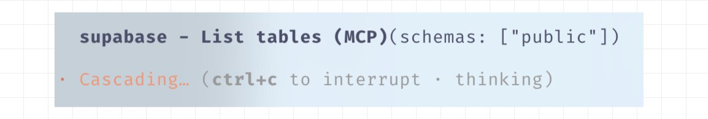
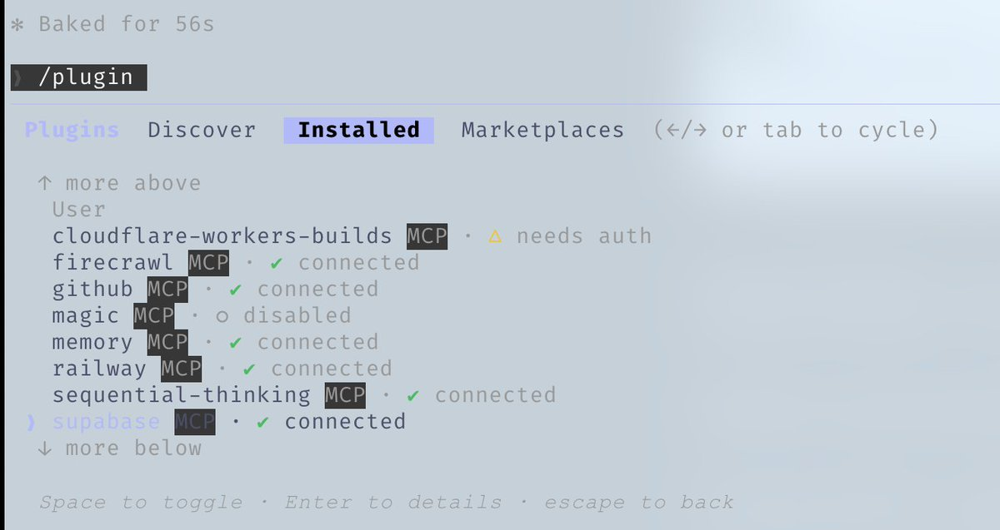
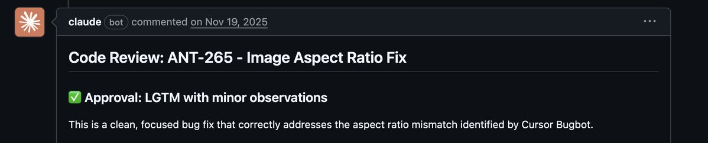
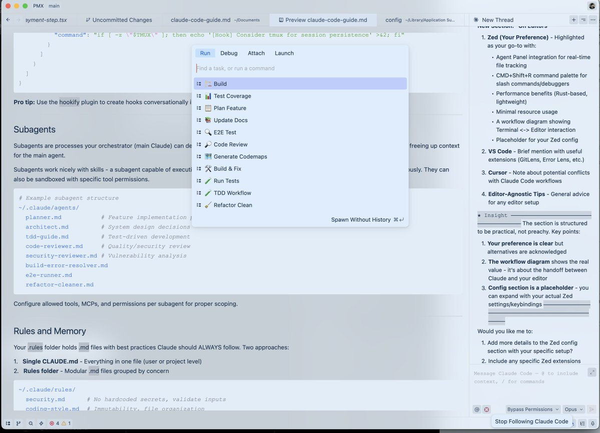
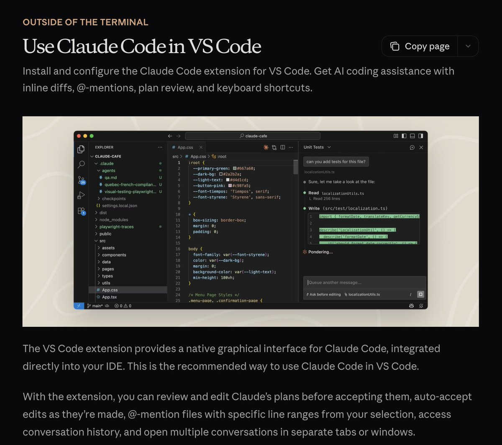
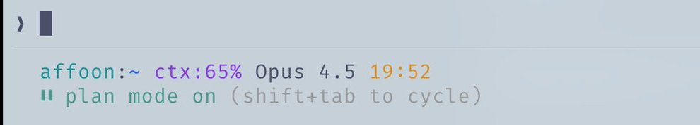

# Claude Code 完全使用指南



这是我经过 10 个月日常使用后总结的完整配置方案：技能、钩子、子代理、MCP、插件，以及那些真正实用的功能。

我从去年 2 月实验性发布阶段就开始深度使用 Claude Code，还凭借完全使用 Claude Code 开发的 Zenith 项目，与 DRodriguezFX 一起赢得了 Anthropic x Forum Ventures 黑客松。

## 技能与命令

技能（Skills）类似于规则，但被限定在特定的范围和工作流中。当你需要执行特定工作流时，它们就是快捷的提示词入口。

比如，用 Opus 4.5 写了很长时间代码后，想清理死代码和零散的 .md 文件？

运行 **/refactor-clean**。需要测试？用 **/tdd、/e2e、/test-coverage**。技能和命令可以在一条提示词中串联使用。


我还可以创建一个在检查点更新代码地图的技能——让 Claude 无需消耗上下文去探索，就能快速了解你的代码库结构。

**~/.claude/skills/codemap-updater.md**

命令是通过斜杠执行的技能。它们有重叠，但存储方式不同：

- **技能：** ~/.claude/skills - 更广泛的工作流定义
- **命令：** ~/.claude/commands - 快速可执行的提示词

```
# 技能目录结构示例
~/.claude/skills/
  pmx-guidelines.md      # 项目特定的模式
  coding-standards.md    # 语言最佳实践
  tdd-workflow/          # 多文件技能，包含 README.md
  security-review/       # 基于检查清单的技能
```

## 钩子

钩子是基于触发器的自动化机制，在特定事件发生时执行。与技能不同，它们绑定在工具调用和生命周期事件上。

### 钩子类型

1. **PreToolUse** - 工具执行前（验证、提醒）
2. **PostToolUse** - 工具执行后（格式化、反馈循环）
3. **UserPromptSubmit** - 你发送消息时
4. **Stop** - Claude 完成响应时
5. **PreCompact** - 上下文压缩前
6. **Notification** - 权限请求时

**示例：长时间命令前的 tmux 提醒**

```json
{
  "PreToolUse": [
    {
      "matcher": "tool == \"Bash\" && tool_input.command matches \"(npm|pnpm|yarn|cargo|pytest)\"",
      "hooks": [
        {
          "type": "command",
          "command": "if [ -z \"$TMUX\" ]; then echo '[Hook] Consider tmux for session persistence' >&2; fi"
        }
      ]
    }
  ]
}
```



PostToolUse 钩子在 Claude Code 中运行时的反馈示例

**小技巧：** 使用 `hookify` 插件通过对话方式创建钩子，而不是手动编写 JSON。运行 **/hookify** 然后描述你想要的功能。

## 子代理

子代理是主代理（主 Claude）可以委托任务的进程，它们有受限的作用域。可以在后台或前台运行，从而释放主代理的上下文空间。

子代理与技能配合得很好——一个能执行特定技能子集的子代理可以自主完成委托的任务。还可以通过工具权限进行沙箱隔离。

```
# 子代理目录结构示例
~/.claude/agents/
  planner.md           # 功能实现规划
  architect.md         # 系统设计决策
  tdd-guide.md         # 测试驱动开发
  code-reviewer.md     # 质量/安全审查
  security-reviewer.md # 漏洞分析
  build-error-resolver.md
  e2e-runner.md
  refactor-cleaner.md
```

为每个子代理配置允许的工具、MCP 和权限，以实现正确的作用域控制。

## 规则与记忆

你的 `.rules` 文件夹存放着 Claude 应该**始终遵循**的最佳实践的 `.md` 文件。有两种方式：

1. **单个 CLAUDE.md** - 所有内容放在一个文件（用户或项目级别）
2. **规则文件夹** - 按关注点分组的模块化 `.md` 文件

```
~/.claude/rules/
  security.md      # 禁止硬编码密钥，验证输入
  coding-style.md  # 不可变性，文件组织
  testing.md       # TDD 工作流，80% 覆盖率
  git-workflow.md  # 提交格式，PR 流程
  agents.md        # 何时委托给子代理
  performance.md   # 模型选择，上下文管理
```

### 规则示例：

- 代码库中不要使用 emoji
- 前端避免使用紫色调
- 部署前务必测试代码
- 优先使用模块化代码而非超大文件
- 永远不要提交 console.log

## MCP（模型上下文协议）

MCP 让 Claude 直接连接外部服务。它不是 API 的替代品——而是围绕 API 的提示词驱动封装，在信息导航上提供更大的灵活性。

**示例：** Supabase MCP 让 Claude 直接提取特定数据、上游运行 SQL，无需复制粘贴。数据库、部署平台等同理。



Supabase MCP 列出 public schema 中的表

**Chrome in Claude** 是一个内置的插件 MCP，让 Claude 可以自主控制你的浏览器——点击查看事物如何运作。

## ⚠️ 关键：上下文窗口管理

对 MCP 要挑剔。我把所有 MCP 都保留在用户配置中，但**禁用所有不用的**。导航到 **/plugins** 向下滚动，或运行 **/mcp**。

启用太多工具会让你的 200k 上下文窗口在压缩前可能只剩 70k。性能会显著下降。



使用 /plugins 导航到 MCP 查看当前安装的工具及其状态

**经验法则：** 配置 20-30 个 MCP，但保持 10 个以下启用 / 80 个以下工具处于活跃状态。

## 插件

插件将工具打包，便于安装，免去繁琐的手动设置。一个插件可以是技能 + MCP 的组合，或者是捆绑在一起的钩子/工具。

### 安装插件：

```bash
# 添加一个市场
claude plugin marketplace add https://github.com/mixedbread-ai/mgrep

# 打开 Claude，运行 /plugins，找到新市场，从那里安装
```



**LSP 插件**如果你经常在编辑器外使用 Claude Code 会特别有用。语言服务器协议为 Claude 提供实时类型检查、跳转定义和智能补全，无需打开 IDE。

```bash
# 已启用的插件示例
typescript-lsp@claude-plugins-official  # TypeScript 智能
pyright-lsp@claude-plugins-official     # Python 类型检查
hookify@claude-plugins-official         # 对话式创建钩子
mgrep@Mixedbread-Grep                   # 比 ripgrep 更好的搜索
```

与 MCP 相同的警告——注意你的上下文窗口。

## 实用技巧

### 键盘快捷键

- **Ctrl+U** - 删除整行（比狂按退格快多了）
- **!** - 快速 bash 命令前缀
- **@** - 搜索文件
- **/** - 启动斜杠命令
- **Shift+Enter** - 多行输入
- **Tab** - 切换思考显示
- **Esc Esc** - 中断 Claude / 恢复代码

### 并行工作流

**/fork** - 分叉对话，并行执行不重叠的任务，而不是排队发送一堆消息

**Git Worktrees** - 用于并行运行多个 Claude 实例且不冲突。每个工作树都是独立的检出

```bash
git worktree add ../feature-branch feature-branch
# 现在在每个工作树中运行独立的 Claude 实例
```

**tmux 用于长时间运行的命令：** 流式查看 Claude 运行的日志/bash 进程

让 Claude Code 启动前端和后端服务器，通过附加到 tmux 会话来监控日志

```bash
tmux new -s dev
# Claude 在这里运行命令，你可以分离和重新附加
tmux attach -t dev
```

**mgrep > grep：** `mgrep` 相比 ripgrep/grep 有显著改进。通过插件市场安装，然后使用 **/mgrep** 技能。支持本地搜索和网络搜索。

```bash
mgrep "function handleSubmit"  # 本地搜索
mgrep --web "Next.js 15 app router changes"  # 网络搜索
```

### 其他实用命令

- **/rewind** - 回到之前的状态
- **/statusline** - 自定义显示分支、上下文占用率、待办事项
- **/checkpoints** - 文件级别的撤销点
- **/compact** - 手动触发上下文压缩

### GitHub Actions CI/CD

在你的 PR 上设置 GitHub Actions 进行代码审查。配置后 Claude 可以自动审查 PR。


### 沙箱模式

对有风险的操作使用沙箱模式——Claude 在受限环境中运行，不影响你的实际系统。（使用 `--dangerously-skip-permissions` 则相反，让 Claude 自由行动，不小心的话可能造成破坏）

## 关于编辑器

虽然不需要编辑器，但它可能正面或负面影响你的 Claude Code 工作流。Claude Code 可以在任何终端运行，但与强大的编辑器配合使用可以解锁实时文件跟踪、快速导航和集成命令执行。

### Zed（我的选择）

我使用 Zed——一个基于 Rust 的编辑器，轻量、快速、高度可定制。

### 为什么 Zed 与 Claude Code 配合良好：

- **代理面板集成** - Zed 的 Claude 集成让你实时跟踪 Claude 编辑的文件变化。在编辑器内跳转到 Claude 引用的文件
- **性能** - 用 Rust 编写，瞬间打开，处理大型代码库无卡顿
- **CMD+Shift+R 命令面板** - 快速访问所有自定义斜杠命令、调试器和工具。即使只想快速运行命令而不切换到终端也很方便
- **最小资源占用** - 在繁重操作时不会与 Claude 争夺系统资源
- **Vim 模式** - 如果你喜欢，完整的 vim 键绑定支持



使用 CMD+Shift+R 的 Zed 编辑器自定义命令下拉菜单

右下角的靶心图标显示跟随模式

### Zed 使用技巧

1. **分屏** - 一边是运行 Claude Code 的终端，另一边是编辑器
2. **Ctrl + G** - 快速在 Zed 中打开 Claude 正在处理的文件
3. **自动保存** - 启用自动保存，确保 Claude 读取的文件始终是最新的
4. **Git 集成** - 使用编辑器的 git 功能在提交前审查 Claude 的更改
5. **文件监视器** - 大多数编辑器会自动重载更改的文件，确认此功能已启用

### VSCode / Cursor

这也是一个可行的选择，与 Claude Code 配合良好。你可以使用终端形式，通过 **\ide** 启用 LSP 功能实现与编辑器的自动同步（现在有了插件后有些冗余）。或者选择扩展版本，它与编辑器更深度集成，有匹配的 UI。



来自官方文档 https://code.claude.com/docs/en/vs-code

## 我的完整配置

### 插件

已安装（我通常一次只启用 4-5 个）：

```
ralph-wiggum@claude-code-plugins       # 循环自动化
frontend-design@claude-code-plugins    # UI/UX 模式
commit-commands@claude-code-plugins    # Git 工作流
security-guidance@claude-code-plugins  # 安全检查
pr-review-toolkit@claude-code-plugins  # PR 自动化
typescript-lsp@claude-plugins-official # TS 智能
hookify@claude-plugins-official        # 钩子创建
code-simplifier@claude-plugins-official
feature-dev@claude-code-plugins
explanatory-output-style@claude-code-plugins
code-review@claude-code-plugins
context7@claude-plugins-official       # 实时文档
pyright-lsp@claude-plugins-official    # Python 类型
mgrep@Mixedbread-Grep                  # 更好的搜索
```

### MCP 服务器

配置（用户级别）：

```json
{
  "github": { "command": "npx", "args": ["-y", "@modelcontextprotocol/server-github"] },
  "firecrawl": { "command": "npx", "args": ["-y", "firecrawl-mcp"] },
  "supabase": {
    "command": "npx",
    "args": ["-y", "@supabase/mcp-server-supabase@latest", "--project-ref=YOUR_REF"]
  },
  "memory": { "command": "npx", "args": ["-y", "@modelcontextprotocol/server-memory"] },
  "sequential-thinking": {
    "command": "npx",
    "args": ["-y", "@modelcontextprotocol/server-sequential-thinking"]
  },
  "vercel": { "type": "http", "url": "https://mcp.vercel.com" },
  "railway": { "command": "npx", "args": ["-y", "@railway/mcp-server"] },
  "cloudflare-docs": { "type": "http", "url": "https://docs.mcp.cloudflare.com/mcp" },
  "cloudflare-workers-bindings": {
    "type": "http",
    "url": "https://bindings.mcp.cloudflare.com/mcp"
  },
  "cloudflare-workers-builds": { "type": "http", "url": "https://builds.mcp.cloudflare.com/mcp" },
  "cloudflare-observability": {
    "type": "http",
    "url": "https://observability.mcp.cloudflare.com/mcp"
  },
  "clickhouse": { "type": "http", "url": "https://mcp.clickhouse.cloud/mcp" },
  "AbletonMCP": { "command": "uvx", "args": ["ableton-mcp"] },
  "magic": { "command": "npx", "args": ["-y", "@magicuidesign/mcp@latest"] }
}
```

按项目禁用（上下文窗口管理）：

```json
// 在 ~/.claude.json 的 projects.[path].disabledMcpServers 中
disabledMcpServers: [
  "playwright",
  "cloudflare-workers-builds",
  "cloudflare-workers-bindings",
  "cloudflare-observability",
  "cloudflare-docs",
  "clickhouse",
  "AbletonMCP",
  "context7",
  "magic"
]
```

这是关键——我配置了 14 个 MCP，但每个项目只启用 5-6 个。保持上下文窗口健康。

### 钩子配置

```json
{
  "PreToolUse": [
    // 长时间运行命令的 tmux 提醒
    { "matcher": "npm|pnpm|yarn|cargo|pytest", "hooks": ["tmux reminder"] },
    // 阻止不必要的 .md 文件创建
    { "matcher": "Write && .md file", "hooks": ["block unless README/CLAUDE"] },
    // git push 前审查
    { "matcher": "git push", "hooks": ["open editor for review"] }
  ],
  "PostToolUse": [
    // 用 Prettier 自动格式化 JS/TS
    { "matcher": "Edit && .ts/.tsx/.js/.jsx", "hooks": ["prettier --write"] },
    // 编辑后 TypeScript 检查
    { "matcher": "Edit && .ts/.tsx", "hooks": ["tsc --noEmit"] },
    // console.log 警告
    { "matcher": "Edit", "hooks": ["grep console.log warning"] }
  ],
  "Stop": [
    // 会话结束前检查 console.log
    { "matcher": "*", "hooks": ["check modified files for console.log"] }
  ]
}
```

### 自定义状态栏

显示用户、目录、git 分支（带脏状态指示器）、剩余上下文百分比、模型、时间和待办数量：



Mac 根目录下的状态栏示例

### 规则结构

```
~/.claude/rules/
  security.md      # 强制安全检查
  coding-style.md  # 不可变性，文件大小限制
  testing.md       # TDD，80% 覆盖率
  git-workflow.md  # 约定式提交
  agents.md        # 子代理委托规则
  patterns.md      # API 响应格式
  performance.md   # 模型选择（Haiku vs Sonnet vs Opus）
  hooks.md         # 钩子文档
```

### 子代理

```
~/.claude/agents/
  planner.md           # 拆解功能
  architect.md         # 系统设计
  tdd-guide.md         # 先写测试
  code-reviewer.md     # 质量审查
  security-reviewer.md # 漏洞扫描
  build-error-resolver.md
  e2e-runner.md        # Playwright 测试
  refactor-cleaner.md  # 死代码移除
  doc-updater.md       # 保持文档同步
```

## 核心要点

1. **不要过度复杂化** - 把配置当作微调，而不是架构设计
2. **上下文窗口很宝贵** - 禁用未使用的 MCP 和插件
3. **并行执行** - 分叉对话，使用 git worktrees
4. **自动化重复性工作** - 用钩子处理格式化、lint、提醒
5. **限定子代理作用域** - 有限的工具 = 专注的执行

## 参考资料

- [插件参考](https://code.claude.com/docs/en/plugins-reference)
- [钩子文档](https://code.claude.com/docs/en/hooks)
- [检查点功能](https://code.claude.com/docs/en/checkpointing)
- [交互模式](https://code.claude.com/docs/en/interactive-mode)
- [记忆系统](https://code.claude.com/docs/en/memory)
- [子代理](https://code.claude.com/docs/en/sub-agents)
- [MCP 概述](https://code.claude.com/docs/en/mcp)

**注：** 这只是部分细节。如果大家有兴趣，我可能会针对具体主题写更多帖子。
