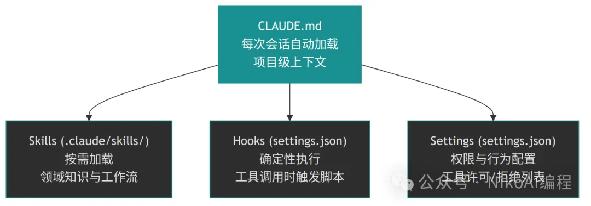
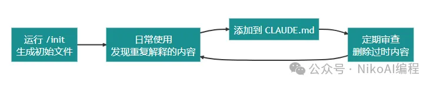

# CLAUDE.md 该怎么写：从零开始打造你的 AI 编程搭档说明书


## CLAUDE.md 实战指南：用 60 行配置让 AI 编程效率翻倍

想象一下这个场景：你每天早上到公司，都要花 10 分钟给新来的同事解释一遍项目用的是 Spring Boot 还是 Spring Cloud、Maven 怎么配置、代码分层规范是什么。你一定觉得荒谬 —— 写个文档不就行了？

CLAUDE.md 就是你写给 Claude Code 的那份文档。

Claude Code 是无状态的：每次对话开始时，它对你的项目一无所知。没有 CLAUDE.md，你就得在每次对话里反复交代同样的背景信息。有了它，Claude 在开始工作前就已经了解你的技术栈、代码规范和项目结构，直接进入高效协作状态。

更重要的是，CLAUDE.md 是 Claude Code 配置体系中"杠杆效应最高的点" —— 它被自动加载到每一次对话中，影响 Claude 的每一个决策。写好这一个文件，相当于给你的 AI 搭档做了一次全面的入职培训。


## 一、CLAUDE.md 到底是什么

CLAUDE.md 是一个 Markdown 格式的文本文件，Claude Code 在每次会话开始时会自动读取它的内容，作为上下文的一部分注入到对话中。你不需要手动引用它，不需要在对话中提到它 —— 它就像一个永远在线的项目说明书。

一句话总结它的定位：

> CLAUDE.md 是 Claude Code 认识你项目的第一份材料，也是唯一一份每次对话都会自动加载的文件。


### 它和其他配置的关系

Claude Code 的配置体系包含多个层级，理解它们的分工有助于你把正确的内容放在正确的位置：



关键区分原则：

- 普遍适用的指令 → 放 CLAUDE.md
- 特定场景的知识 → 放 Skills
- 必须执行的动作 → 放 Hooks
- 工具权限控制 → 放 Settings


### 文件放在哪里

CLAUDE.md 支持多个放置位置，形成一个从全局到局部的层级体系：

|位置|作用域|是否提交Git|使用场景|
|--|--|--|--|
|~/.claude/CLAUDE.md| 所有项目|否|个人全局偏好(如始终用中文回答)|
|./CLAUDE.md|当前项目|是(推荐)|团队共享的项目规范|
|./CLAUDE.local.md|当前项目|否(加入.gitignore)|个人本地配置|
|./子目录/CLAUDE.md|子目录|是|模块级别的特殊规范|
|父目录的 CLAUDE.md|父级项目|是情况|多模块项目场景|

Claude Code 会自动合并这些层级的内容。在多模块 Maven 项目中，这个层级机制尤其有用 —— 你可以在根目录放通用规范，在各子模块目录放模块特有的说明。


## 二、应该写什么：WHAT-WHY-HOW 框架

一份好的 CLAUDE.md 需要回答三个问题：项目是什么（WHAT）、为什么这么做（WHY）、怎么在项目中工作（HOW）。


### 2.1 WHAT —— 告诉 Claude 项目的技术地图

这部分让 Claude 快速了解项目的技术栈和代码结构。

```
# 项目概述
这是一个基于 Spring Boot 3.2 + Java 21 的电商订单管理系统。
 
# 技术栈
- 框架: Spring Boot 3.2
- 语言: Java 21
- 构建工具: Maven 3.9
- 数据库: MySQL 8.0 + MyBatis-Plus
- 缓存: Redis (Lettuce)
- 消息队列: RocketMQ
- 测试: JUnit 5 + Mockito
 
# 项目结构 (标准分层架构)
- src/main/java/com/acme/order/
  - controller/   - REST 接口层
  - service/      - 业务逻辑层
  - service/impl/ - 业务逻辑实现
  - mapper/       - MyBatis 数据访问层
  - model/
    - entity/     - 数据库实体
    - dto/        - 数据传输对象
    - vo/         - 视图对象
  - config/       - 配置类
  - common/       - 公共工具和常量
```

### 2.2 WHY —— 解释关键的设计决策

这部分解释那些"不看说明就会踩坑"的设计决策。Claude 最需要的不是"该怎么做"，而是"为什么这么做"。
```

# 设计决策
- 使用 MyBatis-Plus 而非 JPA/Hibernate
  原因：团队更熟悉 SQL 优化，MyBatis-Plus 提供灵活的 SQL 控制能力
- 所有接口返回统一响应体 Result<T>，不直接返回实体
  原因：前后端约定统一的数据格式，便于全局异常处理
- 分布式 ID 使用雪花算法 (Snowflake)，不使用数据库自增
  原因：分库分表场景下保证 ID 全局唯一且有序
```

### 2.3 HOW —— 告诉 Claude 怎么干活

这部分是 Claude 真正"动手"时需要的操作手册。
```

# 常用命令
- 编译打包: `mvn clean package -DskipTests`
- 运行全部测试: `mvn test`
- 运行单个测试类: `mvn test -Dtest=OrderServiceTest`
- 本地启动: `mvn spring-boot:run -Dspring-boot.run.profiles=dev`
- 代码格式化: `mvn spotless:apply`
- 依赖检查: `mvn dependency:tree`
 
# 代码规范
- Controller 层只做参数校验和结果封装，不写业务逻辑
- Service 接口和实现分离，接口放 service/ 包，实现放 service/impl/ 包
- 所有数据库实体继承 BaseEntity（包含 id, createTime, updateTime）
- 方法命名: findXxx / saveXxx / updateXxx / removeXxx
- 提交信息遵循 Conventional Commits 规范
 
# Git 工作流
- 分支命名: feature/xxx, fix/xxx, chore/xxx
- 提交前必须通过编译和 checkstyle 检查
```

## 三、怎么写才好：六条黄金法则


### 法则一：保持精简，控制在 200 行以内

这是最重要的一条法则。CLAUDE.md 的每一行都会被注入到对话上下文中，占用宝贵的 token 预算。

研究表明，前沿 LLM 能可靠遵循的独立指令数量大约在 150-200 条。Claude Code 的系统提示已经包含了约 50 条指令，留给你的 CLAUDE.md 的"指令预算"其实很有限。

**判断标准：** 对于每一行内容，问自己 —— "如果删掉这行，Claude 会犯错吗？" 如果答案是否，果断删掉。


### 法则二：用引用拆分文档，而非塞进一个文件

CLAUDE.md 支持通过 `@` 语法引用其他文件，实现"渐进式披露"（Progressive Disclosure）：
```
# 项目指南
@README.md
@docs/architecture.md
@docs/database-design.md
@docs/api-conventions.md
```

Claude 会在需要时主动去读取这些文件，而不是每次对话都加载全部内容。这样你的 CLAUDE.md 保持精简，同时 Claude 又能在需要时获取详细信息。


### 法则三：用工具约束格式，而非用指令

一个常见的错误是在 CLAUDE.md 里写大量代码风格规则：
```

# 不推荐
- 缩进使用 4 个空格
- 左大括号不换行
- 类名使用 PascalCase
- 常量使用 UPPER_SNAKE_CASE
- import 语句按包名排序
```

Claude 不是代码检查工具。这些规则应该交给 Checkstyle、Spotless、SonarLint 等工具来强制执行，然后在 CLAUDE.md 里只需要写一句：

```

# 代码风格
代码提交前会自动运行 `mvn spotless:apply`，无需手动关注格式问题。
```


如果你需要确保 Claude 每次提交前都执行格式化，应该使用 Hooks 而非 CLAUDE.md 指令。


### 法则四：对关键规则使用强调语法

当某条规则特别重要时，可以使用大写或强调标记来提高 Claude 的遵循率：

Anthropic 官方建议使用 "IMPORTANT"、"YOU MUST"、"NEVER" 等强调词来提高指令遵循度。但不要滥用 —— 如果每条规则都标注为"重要"，那就等于没有重要的规则。

```
IMPORTANT: 所有数据库操作必须通过 MyBatis-Plus 的 Mapper 接口，禁止在 Service 层拼接 SQL 字符串。
 
IMPORTANT: 不要修改 src/main/java/com/acme/order/generated/ 目录下的任何文件，这些是 MyBatis Generator 自动生成的代码。
```
### 法则五：记录"坑"和"怪癖"

项目中总有一些违反直觉的设计或已知的陷阱，这些才是 CLAUDE.md 最有价值的内容：

```

# 注意事项
- 权限校验通过自定义注解 @RequirePermission 在 AOP 中统一处理
  如果要新增需要权限的接口，只需在 Controller 方法上加注解即可
- 测试环境使用 H2 内存数据库，配置在 application-test.yml 中
  运行测试前不需要启动外部数据库
- legacy/ 包下的代码正在迁移中，新功能不要引用这个包
```

### 法则六：像维护代码一样维护 CLAUDE.md

CLAUDE.md 不是写一次就完事的文件。随着项目演进，你应该定期审查和更新它：

- 发现 Claude 反复犯同一个错误 → 加一条规则
- 发现 Claude 忽略了某条规则 → 检查文件是否太长导致规则"被淹没"
- 项目技术栈变更 → 及时更新

一个好的实践是：在日常使用中，每当你发现自己在对话中反复解释某件事，就按 `#` 键把它加入 CLAUDE.md。久而久之，这个文件会真正反映出你的团队实际的工作方式。


## 四、一个完整的实战示例

下面是一个真实项目级别的 CLAUDE.md 参考模板，大约 60 行，涵盖了最核心的信息：
```

# 项目概述
这是 Acme 公司的内部订单管理系统，基于 Spring Boot 3.2 + Java 21。
 
# 技术栈
- Spring Boot 3.2, Java 21, Maven 3.9
- 数据库: MySQL 8.0 + MyBatis-Plus 3.5
- 缓存: Redis (Spring Data Redis + Lettuce)
- 消息: RocketMQ 5.x
- 测试: JUnit 5 + Mockito + H2
 
# 常用命令
- 编译: `mvn clean compile`
- 打包: `mvn clean package -DskipTests`
- 全部测试: `mvn test`
- 单个测试: `mvn test -Dtest=OrderServiceTest`
- 本地运行: `mvn spring-boot:run -Dspring-boot.run.profiles=dev`
- 格式化: `mvn spotless:apply`
- 依赖树: `mvn dependency:tree`
 
# 项目结构 (com.acme.order)
- controller/   - REST 接口，只做参数校验和结果封装
- service/      - 业务接口定义
- service/impl/ - 业务逻辑实现
- mapper/       - MyBatis 数据访问层
- model/entity/ - 数据库实体 (继承 BaseEntity)
- model/dto/    - 请求/响应数据传输对象
- model/vo/     - 视图对象
- config/       - Spring 配置类
- common/       - 工具类、常量、统一响应体 Result<T>
 
# 代码规范
- Controller 不写业务逻辑，Service 接口与实现分离
- 所有接口返回 Result<T> 统一响应体
- 方法命名: findXxx / saveXxx / updateXxx / removeXxx
- 提交信息遵循 Conventional Commits
 
# 详细文档
@docs/architecture.md
@docs/database-design.md
@docs/deployment.md
 
# Git 工作流
- 分支: feature/xxx, fix/xxx, chore/xxx
- PR 必须通过 CI 检查后才能合并
 
# 注意事项
IMPORTANT: 数据库操作通过 MyBatis-Plus Mapper，禁止拼接 SQL 字符串
IMPORTANT: generated/ 包是自动生成的，不要手动修改
- legacy/ 包下的代码正在迁移，新功能不要依赖
- 环境变量在 application-dev.yml 中说明，敏感配置走 Nacos
- 分布式 ID 使用雪花算法，不要用数据库自增 ID
```

## 五、从 /init 开始，但不要止步于此

如果你的项目还没有 CLAUDE.md，最快的起步方式是在项目目录下运行 `/init` 命令。Claude 会自动分析你的项目结构、读取 pom.xml 等配置文件，生成一份初始的 CLAUDE.md。

但要注意：`/init` 生成的只是一个起点。它能捕捉到明显的模式，但可能遗漏你的团队特有的工作流程和约定。真正有价值的 CLAUDE.md 是在日常使用中逐步打磨出来的。



## 六、总结

写好 CLAUDE.md 的核心思路可以归纳为三句话：

1. **写对的内容**：用 WHAT-WHY-HOW 框架覆盖项目的技术地图、设计决策和操作手册
2. **控制好篇幅**：200 行以内，用 @ 引用拆分详细文档，把格式校验交给工具
3. **持续迭代**：像维护代码一样维护它，让它真实反映团队的工作方式

CLAUDE.md 本质上是你和 AI 之间的一份契约 —— 你告诉它项目的规则和边界，它在这个框架内高效地帮你完成工作。花 30 分钟写好这份"契约"，能为你节省未来无数次重复解释的时间。
 
