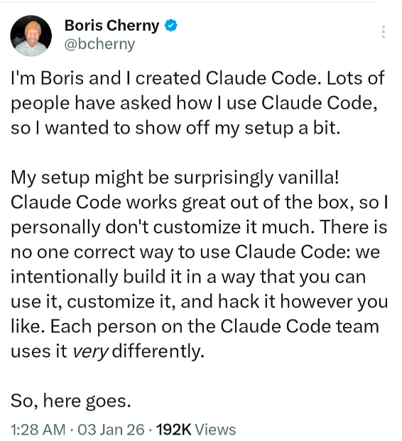

# 学会这6条规则，让Claude Code 越用越懂你

**作者**: 破晓AI编程

**来源**: https://mp.weixin.qq.com/s/xBFugYKkB_RJFXaoIYfiPw

---

不久前，Claude Code 的创造者 Boris Cherny 干了一件挺不寻常的事。

他把自己每天用的工作流完整公开了——不是写了一篇经验文章，是把他项目里的 CLAUDE.md 配置文件、任务管理循环、提示词风格，一起晒了出来。

他是 Anthropic 的 Staff Engineer，Claude Code 这个工具就是他做的。

有人评论：当造工具的人告诉你他怎么用，这就不是经验分享了，这是答案。

我之前写的[10个技巧，通关Claude Code](https://mp.weixin.qq.com/s?__biz=Mzk4ODM4MjYyMw==&mid=2247483941&idx=1&sn=0fe1eacf3715edbb952f007a2f625667&scene=21#wechat_redirect)，很多技巧其实就脱胎于这套工作流。这篇算是那篇的前传——先搞懂作者的底层逻辑，再去看那些技巧会清晰很多。

## 你的配置文件越写越长，他的只有 100 行

很多人的 CLAUDE.md 越写越长，500 行、800 行，什么都往里塞，生怕漏掉什么。

Boris 的文件大概 100 行，2500 个 token 左右。

但他不是懒得写。他们团队的规则只有一条：**每次 Claude 做错了什么，才加一行进去，让它不再重复。**文件里的每一行，都是真实踩过的坑。

为什么要控制长度？因为 CLAUDE.md 的每一行都在消耗 context window（上下文窗口）。文件越长，Claude 每次启动消耗的上下文越多，留给真正干活的空间就越少。更重要的是，规则太多，Claude 反而容易顾此失彼——就像给新员工一次性丢去一本厚厚的操作手册，不如每次出了问题现场教一条，记得更牢。

他的文件分三块，完整内容如下：

每一条背后都有着深刻的实战经验：

**Plan Mode Default**：AI 出问题，通常不是执行能力不够，而是方向一开始就歪了。任务越复杂，前期方向偏一点，后面返工成本就越高。先写计划、确认计划，是在省后面改稿的时间，不是多此一举。

**Subagent Strategy**：context window 是有限资源，用满了 Claude 就开始"忘事"。把探索、调研、子任务拆给 subagent 去跑，主 session 只保留最核心的上下文——相当于让主力专注主线，杂活交给助理。

**Self-Improvement Loop**：这是整份文件里最有价值的一条。AI 没有跨 session 的记忆，你今天纠正它，明天开新对话它又犯同样的错。把每次纠正沉淀成规则写进 CLAUDE.md，就是在给 AI 建一套"项目专属记忆"，时间越长越好用。

**Verification Before Done**：AI 有一个典型毛病——它会给你一个"看起来完成了"的结果，但实际上没跑通。设置验收标准，强迫它自证，能过滤掉大量表面完成、实际有坑的输出。

**Demand Elegance**：这条有个重要限定——"有节制地"。简单修复不要过度设计，只有真正复杂的问题才停下来想更优雅的方案。这是在防止 AI 为了显得聪明，把一个简单问题搞复杂。

**Autonomous Bug Fixing**：粘贴 bug 报告直接说"Fix"，背后的逻辑是：Claude 有足够能力自己分析问题、定位原因、给出修复。你介入越多，它反而越依赖你的引导，独立性越差。

最值得单独说的是任务管理的第六步——**Capture Lessons**。

每次 Claude 犯错被纠正，Boris 就让它把这次纠正变成一条规则，写进 lessons.md，再合并进 CLAUDE.md。他的原话是：Claude "有一种说不清的能力，能给自己写出很好的规则"。

**你纠正它一次，它帮你变成一条以后不再犯的标准。这是一个会随时间自动增值的系统——你用得越久，它越懂你。**

三条核心原则也值得多说一句。Simplicity、No Laziness、Minimal Impact，听起来像废话，但实际上是在约束 AI 的"过度行为"。AI 天然有一种倾向：为了显得有用，它会多写、多改、多加，把一个简单问题复杂化。这三条原则专门用来对抗这个倾向——**不是激励它做更多，是限制它别做多。**

## 他发出去的 prompt，最短只有三个字

Boris 给的从来不是步骤说明书，而是验收标准：

最后那条是原文，就三个字 "Fix"。

为什么这样有效？当你给 Claude 步骤说明时，它会把注意力放在"按步骤执行"上，而不是"把事情真正做好"上。给验收标准，它反而会自己想办法达到那个标准——路径它来找，你只负责判断结果。

团队内部管这叫 "Don't babysit"——别盯着 AI，让它自己完成。

副业党最容易浪费时间的地方，恰恰是反复调整 prompt、逐步确认、担心跑偏。这种做法表面上是"控制质量"，实际上是把自己变成了 AI 的运维。**给结果标准，把过程交出去，你的时间才真正解放了。**

## Anthropic 官方做了背书，四条和他的高度吻合

除了 Boris 个人的配置，Anthropic 也配套发布了官方最佳实践文档。有意思的是，官方总结的四条，和 Boris 个人的工作方式高度吻合。

**Rule 01：管好你的 Context Window**

这就是 Boris 大量用 subagent 的原因。前面说过，context 满了 Claude 就开始"忘事"，把子任务拆给 subagent，主 session 才能保持清醒。官方的建议是：新任务开新 session，不要把信息"以防万一"地全塞进去。

**Rule 02：永远先写计划**

也就是 Boris 说的 Plan Mode Default。官方加了一个细节：可以让一个 Claude 起草方案，再让另一个 Claude 以 "staff engineer 视角" 审查，通过了才开始执行。两个 Claude 互相审，比你自己盯着看可靠。

**Rule 03：认真维护你的 CLAUDE.md**

就是 Self-Improvement Loop 落地之后的结果。官方的补充是：这个文件要提交进 git，整个团队共用，每周更新好几次。**一份三个月没更新的 CLAUDE.md，跟没有差不多。**

**Rule 04：并行跑 session**

Boris 同时开 10 到 15 个 session，每个绑一个独立的 git worktree（工作树），互不干扰。

为什么并行有效？AI 跑任务的时候你不需要盯着。启动一个任务，转头启动下一个，等第一个跑完再去验收。对每天只有一两个小时副业时间的人来说，这条最直接——两个 session 同时跑，启动成本不变，产出密度翻倍了。

## 不写代码的人，这套逻辑照样能用

Boris 在文章里也说了，这套哲学不只给开发者。

翻译成更通用的版本：

•**先约定结构，再开始做。**不管写文章、做方案还是整理资料，先跟 Claude 对齐你想要的结果，别让它直接就跑。

•**保持 context 干净。**新任务开新对话，不要把十件事塞进一个窗口。

•**从错误里长出规则。**Claude 给错了，告诉它哪里错了，让它记住。下次会准很多。

•**给目标，不给步骤。**告诉它你要什么，让它想怎么做。

## 今天就能做的一件事

直接把 Boris 的这份 CLAUDE.md 拿过来，放进你的项目根目录。

不用从零开始写——他已经帮你把框架搭好了，三条原则、六条工作流规则、六步任务循环，都在里面。你要做的只有一件事：**用的过程中发现哪里不对，就加一行进去。**

这是他自己的方式，也是最快上手的方式。
